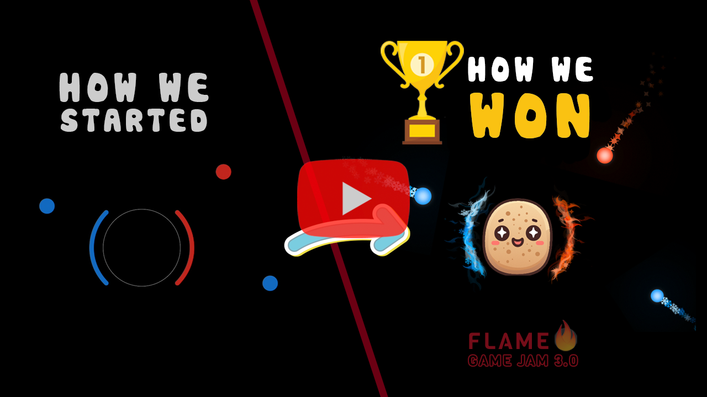
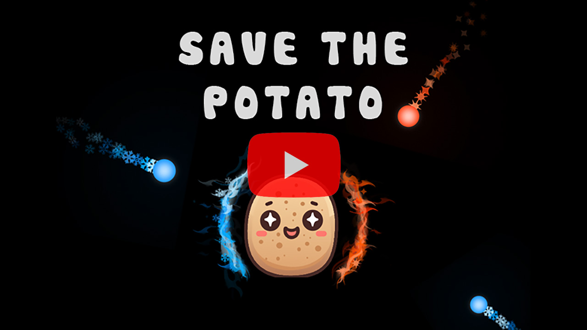

# Save The Potato
#### Winner of the **[Flame Jam 3](https://itch.io/jam/flame-jam-3/results)** 🏆

| Behind the Scene                                                                            | Demo                                                                                    |
|---------------------------------------------------------------------------------------------|-----------------------------------------------------------------------------------------|
|  |  |

## General info
This game is developed during the [Flame Game Jam 3](https://itch.io/jam/flame-jam-3) by [Fateme](hhttps://www.linkedin.com/in/fateme-bahrami-388585156) and [@imaNNeo](https://github.com/imaNNeo)(me) using [Flutter](https://flutter.dev/) and [Flame game engine](https://flame-engine.org/)

* There was a theme that we needed to stick into it, it was **Hot & Cold**
* There were three limitations that we could choose from:
	* Single Button Input
	* Multiple Endings
	* **No Text** (this is what we chose)

## Useful links
* Play it live [here](https://savethepotato.app2pack.dev/)
* [Demo video](https://www.youtube.com/watch?v=IuXIr0qrsvM)
* This is [our submission at itch](https://itch.io/jam/flame-jam-3/rate/2414926)

# Development
You need to run `fastlane match development` to get the certificates and profiles for development (based on [this article](https://medium.com/@seshasai_30381/flutter-github-actions-a-ci-cd-pipeline-for-flutter-apps-with-github-actions-fastlane-and-7ca9a6b2a1cc))
To do that, you have to setup the below environment variables (these are on the Bitwarden):
* `FASTLANE_USER` => Your team id of Apple Developer
* `ITC_TEAM_ID` =>  Your team id of App Store Connect
* `TEAM_ID` => Your Apple Developer Team ID

Also, we run `fastlane match appstore` to get the certificates and profiles for the publish process (it handled in the CI/CD)

# Release
Here is the [release guide](./docs/RELEASE_GUIDE.md)