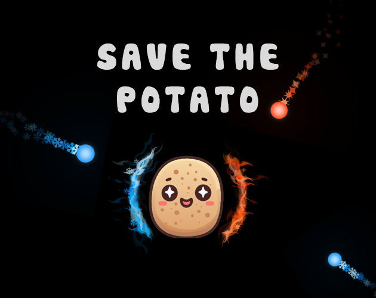

# Save The Potato

## General info
This game is developed during the [Flame Game Jam 3](https://itch.io/jam/flame-jam-3) by me [Fateme](hhttps://www.linkedin.com/in/fateme-bahrami-388585156) and [@imaNNeo](https://github.com/imaNNeo)(me) using [Flutter](https://flutter.dev/) and [Flame game engine](https://flame-engine.org/)

* There was a them that we needed to stick into it, it was **Hot & Cold**
* There were three limitations that we could choose from:
	* Single Button Input
	* Multiple Endings
	* **No Text** (this is what we chose)

## Useful links
* Play it live [here](https://savethepotato.app2pack.dev/)
* [Demo video](https://www.youtube.com/watch?v=IuXIr0qrsvM)
* This is [our submission at itch](https://itch.io/jam/flame-jam-3/rate/2414926)

